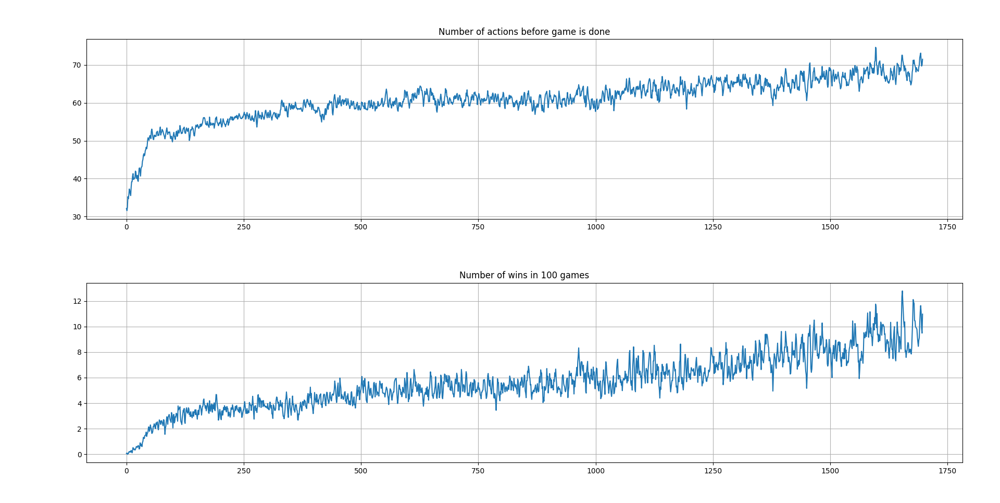

<div align="center">

<h1 align="center">super-ml-pets</h1>
<h3 align="center">Framework for training and deploying AIs for Super Auto Pets</h3>

[](https://opensource.org/licenses/MIT)


[](https://www.python.org/dev/peps/pep-0008/)
 
Train AIs for Super Auto Pets through a simulated environment and test the trained model against real opponents in the actual game! AI is trained using reinforcement learning and a machine vision system is used to capture the screen to give information to the AI.

</div>

_NOTE: Framework supports Python 3.7-3.10 and works cross-platform (Ubuntu, Windows, macOS)._

## Getting started

1. Clone the repo:
```
git clone https://github.com/andreped/super-ml-pets.git
```

2. Setup virtual environment:
```
cd super-ml-pets/
virtualenv -ppython3 venv --clear
source venv/bin/activate
```

3. Install requirements:
```
pip install -r requirements.txt
```

<details>
<summary>

### Additional setup for Ubuntu only </summary>
```
sudo apt install python3-tk
sudo su
source venv/bin/activate
xhost +
export DISPLAY=:0.0
```

Note that the command `sudo su` enables sudo rights. This seems to be required by `keyboard` as mentioned in issue https://github.com/andreped/super-ml-pets/issues/23. The xhost + DISPLAY stuff is needed as the screen might not be found, hence, initializing one solves this issue.

</details>

## Usage
This framework currently supports training and deploying RL models for SAP.

<details open>
<summary>

### Training </summary>

For training in simulated environment, using default arguments, simply run:
```
python main.py --task train
```

Given an existing model, it is also possible to finetune it by (with example):
```
python main.py --task train --finetune ./models/model_sap_gym_sb3_180822_checkpoint_2175_steps.zip
```

The script supports other arguments. To see what is possible, run:
```
python main.py --help
```

</details>

<details open>
<summary>

### Testing </summary>

1. To use a trained model in battle, start the game Super Auto Pets.

2. Ensure that the game is in full screen mode, disable all unneccessary prompts, enable auto name picker, and set speed to 200% (you might also have to enable auto battle which can only be done in the first battle - if this is the first time you are playing this game).

3. Enter the arena by clicking "Arena mode".

4. Go outside the game and download a pretrained model from [here](https://github.com/andreped/super-ml-pets/releases/tag/v0.0.2), or use any pretrained model you might have.

5. Then, simply start the AI by running this command from the terminal (with example path to pretrained model, **without extension .zip**):
```
python main.py --task deploy --infer_model /path/to/pretrained/model/model_sap_gym_sb3_180822_checkpoint_finetuned
```

6. Go back into the game and press the "Space" keyboard button (when you are in the Arena (in team preparation, before battle).

It might take a few seconds, but you should now be able to see the AI start playing. Please, let it play in peace, or else it might get angry and you have accidentally creating [Skynet](https://en.wikipedia.org/wiki/Skynet_(Terminator)). If you accidentally exit the game, or dont have the game in fullscreen, the machine vision system will fail, and you will have to start a completely new game to use the AI (properly).

</details>

<details open>
<summary>

### Training history </summary>

It is possible to plot the training history by running (might require some path adjustments... To be fixed in the future):
```
python src/plot_history.py --log /path/to/history/progress.csv
```

<p align="left">
  
</p>

</details>

<details>
<summary>

### Troubleshoot </summary>

If you are working on Windows, you need to use slightly different commands for setting up the environment. If you do not have virtualenv in the path, you need to do:
```
python -m virtualenv -ppython3 venv --clear
```

To activate virtual env on windows do:
```
./venv/Scripts/activate
```

If you are using newer versions of Python (e.g., 3.10.x), you might have issues with installing and/or using `numpy` with the other dependencies. If that happens, try downgrading numpy by:
```
pip install numpy==1.23.2 --force-reinstall
```

Note that Python 3.11 is not supported as dependencies such as `scipy` fail to install. This will probably
change in the future, but for now only python versions 3.7-3.10 are supported.

</details>

## Acknowledgements
This implementation is based on multiple different projects. The core implementation is derived from [GoldExplosion](https://github.com/GoldExplosion/SuperAutoPets-RL-Agent), which further was based upon the super auto pets engine [sapai](https://github.com/manny405/sapai) and RL training through [sapai-gym](https://github.com/alexdriedger/sapai-gym).
